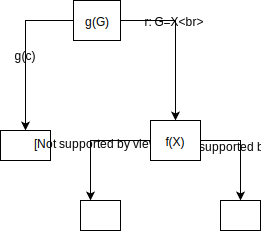

# Kontrollfragen

## Imperative Programmierung 1

1. Charakterisieren Sie in eigenen Worten, wie imperative Programmierung funktioniert. Aus welchen Grundelementen sind imperative Programme aufgebaut? Wie werden derartige Programme ausgeführt, wie verläuft der Kontrollfluss?

> Sequentielles Abarbeiten von Anweisungen.

2. In welchem Verhältnis stehen imperative und strukturierte Programmierung?

> Strukturierte Programmierung ist eine Spezialisierung der imperativen Programmierung mit der Einschränkung, dass nur gewisse Kontrollstrukturen (Sequenzen , Auswahl & Wiederholungen) verwendet werden sollen.
> Insbesondere soll kein GOTO verwendet werden.

3. Durch was hebt sich die prozedurale Programmierung vom imperativen Programmierparadigma ab?

> Spezialisierung des imperativen Paradigmas, bietet Unterteilung von Programmen in Teilprogramme (= Prozedur, auch: Routine, Unterprogramm, Funktion).

## Imperative Programmierung 2

1. Was ist ein ADT?

> Abstrakte Datentypen (ADT) sind mathematische Modelle für Datenstrukturen und darauf definierte Operationen (mit vorgegebenem Effekt)
> – Semantik ist vorgegeben, nicht aber Implementierung

2. Worin unterscheidet sich die Implementierung von einem ADT in C fundamental von einer Implementierung in Java?

> Zusammenbringen von Daten und Operationen war eine der Hauptmotivationen für „Objektorientierung“
> Die Funktionen „hängen“ direkt an den Daten: Klassen haben definierte „Daten“ (Zustand: Instanzvariablen) und „Funktionen“ (Verhalten: Methoden)

3. Um welche Konzepte erweitert die OO- Programmiersprache Java im wesentlichen die prozedurale Programmiersprache C?

> – Klassen + Instanzen: class, extends, instanceof, new, this, super
> – Interfaces:interface,implements
> – Packages:package,import
> – Sichtbarkeit:private,protected,public
> – Exception-Handling:try,catch,finally,throw(s)

## Prolog 1

1. Wie antwortet das Prolog-System in unserem
   Beispiel auf die Anfrage is_bigger(elephant,
   fly)?
   > false
2. Was ist in unserem Beispiel der Unterschied
   zwischen bigger(X, Y) und is_bigger(X, Y)?
   > is_bigger ist die transitive Hülle
3. Definieren sie für das gegebene Beispiel eine Regel
   für is_smaller(X, Y). (Hinweis: Das geht in
   einer Zeile)
   > is_bigger(Y, X)

Wie wird Prolog auf die folgenden Anfragen antworten?

1. ?- X=tom, X=pia.
   > false.
2. ?- 'tom'(pia) = tom('pia').
   > true.
3. ?- s(t(g), X) = s(Y, u).
   > X = u,
   > Y = t(g).
4. ?- X = f(X).
   > X = f(X).

Die letzte Anfrage _sollte_ gemäss Regeln `false` geben, aber aus Effizienzgründen wird dieser Check aber nicht standardmässig gemacht.

## Prolog 2

1. Wie viele Lösungen für ein Kreuzworträtsel findet unser Programm grundsätzlich?
   > Eine Lösung.
2. Unser Programm findet für das angegebene Kreuzworträtsel genau eine Lösung. Wie liesse sich das Kreuzworträtsel einfach erweitern, so dass es neu eine zweite Lösung findet? Wie müssten wir dazu das angegeben Programm erweitern? (Machen sie konkrete Vorschläge!)
   > Indem wir mehr Wörter definieren, die ebenfalls an bestimmten Stellen passen würden. Zum Beispiel 'mist', 'most', 'must', ...
3. Was würde Prolog antworten, wenn es für ein angegebenes Kreuzworträtsel gar keine Lösung gibt?
   > false.

## Prolog 3

1. Wie können sie mit dem angegebenen Prädikat fak/2 herausfinden, was das X bei X! = 720 ist?
   > fak(X, 720).
   > Gibt Fehler aus, können wir so noch nicht machen
2. Wie können sie mittels fib/2 überprüfen, ob die 8-te Fibonacci-Zahl 21 ist?
   > fib(8,21).
3. Was würde passieren, wenn sie beim angegebenen Prädikat fib/2 die beiden Zeilen „N1 = ...“ und „N2 = ...“ weglassen und stattdessen die beiden rekursiven Aufrufe direkt machen als fib(N-1, F1) und fib(N-2, F2)? Funktioniert die Berechnung trotzdem? Begründen sie ihre Antwort
   > Es geht nicht, weil dann 'N-1' gematcht wird statt berechnet

## Prolog 4

1. Gegeben sei eine Wissensdatenbank mit den
   folgenden drei Fakten f(a). f(b). g(c). und
   der Regel g(X) :- f(X). Welche Resultate
   werden auf die Anfrage g(G) in welcher
   Reihenfolge geliefert?

   ```prolog
   ?- g(G).
   G = c ;
   G = a ;
   G = b.
   ```

2. Zeichnen sie den kompletten Suchbaum zu obigem Beispiel mit der Anfrage g(G).
   

3) Welches Resultat wird in obigem Beispiel auf die Anfrage g(a) geliefert?

   ```prolog
   true.
   ```

4) Was für Konsequenzen kann das Ändern der
   Reihenfolge von Regeln und der Reihenfolge der Ziele von einzelnen Klauseln für eine Prozedur haben?
   > Im Allgemeinen: Reihenfolge der Abfragen. Das kann zu grösseren Suchbäumen und in bestimmten Fällen sogar zu Endlosrekusion führen.

## Prolog 5

Beantworten sie die folgende Fragen in eigenen Worten:

1. Was bewirkt das eingebaute Prädikat all_distinct/1 ?
   > Jeder Wert kommt nur einmal vor.
2. Was bewirkt das eingebaute Prädikat maplist/2 ?
   > Wendet das erste Argument (Prädikat) auf alle Elemente des zweiten (Liste) an. Gibt true, falls alles true gibt.
   > Erläutern Sie die Anwendung an einem eigenen
   > Beispiel.
3. Was bewirkt transpose/2 auf eine Liste von Listen?
   > Dreht die Matrix (Reihen <-> Zeilen).
   > Machen Sie zur Illustration ein Beispiel dazu.
   > [A,B][c,d]
   > transposed:
   > [A,C][b,d]
4. Was passiert, wenn sudoku/1 mit einer Liste von 9
   Listen mit je 9 anonymen Variablen aufgerufen wird?
   (Was ist also die von Prolog ermittelte Lösung zu einer
   Sudoku-Instanz ohne vorgegebene Zahlen?)
