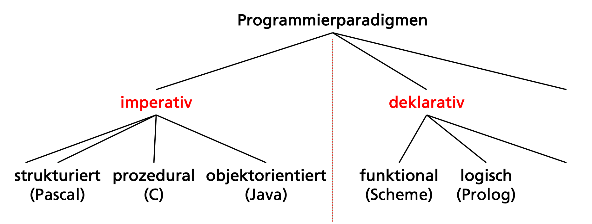

# Einführung Programmierparadigmen

[Wikipedia](https://en.wikipedia.org/wiki/List_of_programming_languages) listet etwa 700 "namhafte" Programmiersprachen auf.

Zusätzlich existieren tausende weitere, spezialisierte Sprachen.

## Wichtige Begriffe

## Programmiersprache

Eine _Programmiersprache_ ist eine formal konstruierte Sprache, entworfen um Befehle an Maschinen, speziell Computer, zu übermitteln. Programmiersprachen werden eingesetzt, um Programme zu schreiben, welche das Verhalten von Maschinen kontrollieren oder welche Algorithmen beschreiben.

Ein _Algorithmus_ ist ein schrittweises Verfahren zur Lösung von einem Problem oder einer Klasse von Problemen.

_Syntax_ gibt die formale Struktur vor, nach dem Programme einer Sprache aufgebaut sind.

_Semantik_ definiert die Bedeutung von Programmen (Anweisungen, Operatoren,...), entspricht also den "Interpretationsregeln".

### Mächtigkeit

Alle Programmiersprachen sind im Prinzip gleich mächtig, d.h. in diesen können dieselben Algorithmen festgehalten werden.

In der Berechenbarkeitstheorie spricht man von _Turing-Vollständigkeit_ (= universelle Programmierbarkeit), wenn eine Programmiersprache grundsätzlich alle Funktionen berechnen kann, die mit einer Turing-Maschine berechnet werden können. Dies ist eine notwendige Bedingung für eine Programmiersprachen.

Gemäss dieser Definition ist z.B. HTML keine Programmiersprache, SQL seit der Einführung von rekursiven Common-Table-Expression mit SQL 1999 aber schon.

> TODO: Kenntnisse & Auswahl von Programmiersprachen

### Programmierparadigma

Ein _Paradigma_ im Allgemeinen beschreibt ein (Denk-)Muster, eine grundlegende Denkweise oder Weltanschauung.

Ein _Programmierparadigma_ ist ein fundamentaler
Programmierstil, eine bestimmt Art die Struktur
und Elemente von Programmen aufzubauen.



> TODO: Mit `dot` selber basteln.

Fundamental ist vor allem die Unterscheidung in _imperative_ und _deklarative_ Programmiersprachen.

Weitere Paradigmen sind beispielsweise:

- Aspekt-orientiert
- Automaten-basiert
- Constraint-orientiert
- Daten-getrieben
- Datenfluss-orientiert
- Ereignis-orientiert,
- generisch
- generativ
- Komponenten-orientiert
- nebenläufig
- modular
- Protokoll-orientiert
- reaktiv
- reflektiv
- ...

_Siehe auch: [Wikipedia](https://en.wikipedia.org/wiki/Programming_paradigm)_

Viele dieser Paradigmen lassen sich in verschiedenen Sprachen umsetzten bzw. integrieren. Diese Paradigmen sind daher typischerweise nicht prägend für eine
bestimmte Programmiersprache.

Wir konzentrieren uns deshalb auf die Programmierparadigmen _imperativ_ (strukturiert, prozedural, objektorientiert) und _deklarativ_ (logisch, funktional).

## Sprachen und Paradigmen

Die meisten Programmiersprachen haben ein
_Hauptparadigma_, das sie befolgen, z.B.:

- Java: objektorientiert
- Prolog: logisch
- Scheme: funktional

Diese Unterscheidung ist nicht messerscharf: objektorientierte Sprachen sind beispielsweise meist auch strukturiert und prozedural und die meisten deklarativen Sprachen haben auch imperative Eigenschaften.

Sprachen müssen nicht exklusiv einem
Programmierparadigma angehören. Programmierparadigmen sind eher komplementär als sich gegenseitig ausschliessend. Viele moderne Sprachen sind _Multiparadigmen-Programmiersprachen_, d.h. sie unterstützen mehrere Paradigmen.

So ist beispielsweise Java zwar primär objektorientiert mit prozeduralen, modularen, ereignisorientierten und (seit Java 8) auch funktionalen Ansätzen.

## Imperativ vs Deklarativ

_Imperative_ Programmierung beschreibt primär das _Wie_:

DIe Problemlösung (Berechnungslogik) wird schrittweise in Befehlen beschrieben: "Wie ist das Problem zu lösen?"

Bespiel Kreis (imperativ):

Resultat einer 360 Grad Rotation um einen festen Mittelpunkt mit dem Zirkel

_Deklarative_ Programmierung beschreibt primär das _Was_:

Berechnungslogik wird beschrieben ohne den Kontrollfluss zu definieren: "Was sind die Fakten zum Problem?"

### Beispiel Kreis

Aufgabe: Zeichne einen Kreis.

- **Imperativ**: Resultat einer 360 Grad Rotation um einen festen Mittelpunkt mit dem Zirkel
- **Deklarativ**: Menge aller Punkte, die von einem vorgegebenen Punkt denselben Abstand hat.

SORT:

_Fun Fact_: Assembler ist _nicht_ strukturiert. Eine Anforderung strukturierte Sprachen, ist das es kein `GOTO` gibt.

### Beispiel GCD

Aufgabe: Berechnung des grössten gemeinsamen Teilers (_greatest common divisor: GCD_) von zwei ganzen Zahlen gemäss dem euklidischen Algorithmus.

_Hinweis: Wir gehen davon aus, dass die beiden Zahlen positive Ganzzahlen sind (ohne dies zu testen)._

**Imperativ / prozedural: (C)**:

```c
int gcd(int a, int b) {
    while (a != b) {
        if (a > b) a = a -b;
        else b = b - a;
    }
    return a;
}
```

Der Fokus ist auf den Befehlen, der Kontrollfluss ist vorgegeben (sequentiell).

**Deklarativ-logisch (Prolog)**:

```prolog
gcd(A, A, A) .
gcd(A, B, G) :- A > B, C is A-B, gcd(C, B, G).
gcd(A, B, G) :- B > A, C is B-A, gcd(C, A, G).
```

Einzelne Fakten und Regeln sind gegeben, aber der Kontrollfluss ist nicht (explizit) vorgegeben.

Aufruf in der Prolog-Konsole:

    ?- gcd(42, 35, X) .
    X = 7

**Deklarativ-funktional (Scheme)**:

```scheme
(define gcd
    (lambda (a b)
        (cond   ((= a b) a)
                ((> a b) (gcd( (- a b) b) ) )
                (else (gcd (- b a) a)))))
```

Fokus auf Definition von Ein- und Ausgaben von Funktionen. Der Kontrollfluss ist nicht (explizit) vorgegeben.

Aufruf in der Scheme-Konsole:

    > (gcd 42 35)
    7

## Imperative Programmierung

> imperare (lat) = befehlen, anordnen

Der Problemlösungs-Algorithmus wird schrittweise durch Befehle angegeben. Der Quellcode gibt an, was der Computer in welcher Reihenfolge tun soll.

Zur Steuerung der Befehlsausführung stehen Kontrollstrukturen (Sequenz, Iteration & Selektion) zur Verfügung. Die meisten populären Programmiersprachen sind imperativ (Java, C#, PHP). Insbesondere funktionieren Hardware-nahe Sprachen wie Assembler oder C praktisch immer so.

Das Imperative Programmierparadigma ist eng angelehnt an die Ausführung von Maschinen-Code auf Computern, die nach der Von-Neumann-Architektur implementiert sind:

- Es gibt bedingte und unbedingte Sprunganweisungen
- Zustand vom Programm ergibt sich aus Inhalt von Datenfeldern im Arbeitsspeicher und Systemvariablen (Register, Befehlszähler)

Die Von-Neumann-Architektur realisiert alle Komponenten einer Turing-Maschine und ist das wichtigste Referenzmodell für Computer.


_https://upload.wikimedia.org/wikipedia/commons/d/db/Von-Neumann_Architektur.svg_

### Strukturierte Programmierung

Die _strukturierte Programmierung_ ist eine Spezialisierung des imperativen Paradigmas, und verlangt insbesondere die Beschränkung auf drei Kontrollstrukturen:

- Sequenzen
- Auswahl
- Wiederholung

Die Konsequenz daraus ist, dass `GOTO` nicht verwendet werden darf. Typische strukturierte Sprachen sind _C_, _Fortan_ & _Pascal_.

_Lesenswerter Artikel_:

„Go To Statement Considered Harmful“ von Edsger Dijkstra (Com. of the ACM, Vol. 11, No. 3, March 1968):

- http://www.u.arizona.edu/~rubinson/copyright_violations/Go_To_Considered_Harmful.html

### Prozedurale Programmierung

Die _prozedurale Programmierung_ ist eine Spezialisierung des imperativen Paradigmas, welches die Unterteilung von Programmen in Teilprogramme (Prozedur, Routine, Funktion, ...) bietet.

Eigenschaften von Prozeduren:

- können Argumente entgegen nehmen und Ergebnisse zurückgeben
- Vermeidung von Code-Duplikation
- Unterscheidung von Programm-globalen und Prozedur-lokalen Variablen

Typische strukturierte Sprachen sind _C_, _Fortan_ & _Pascal_.

### Objektorientierte Programmierung

Die _objektorientierte Programmierung_ ist eine Spezialisierung des imperativen Paradigmas. Laufende Programme bestehen aus einzelnen Objekten, welche miteinander interagieren (Nachrichten austauschen, Methoden aufrufen) können.

Objekte sind typischerweise Instanzen von Klassen, aber es gibt auch andere Ansätze (z.B. Prototypen bei JavaScript).

Typische Eigenschaften von Objektorientierung mit Klassen:

- Klasse definiert Zustand (Variablen) & Verhalten (Methoden)
- Vererbung
- Polymorphismus

Die objektorientierte Programmierung als Weiterentwicklung von prozeduraler Programmierung und abstrakten Datentypen. Typische Sprachen sind:

- _Smalltalk_
- _Objective C_
- _C++_
- _Java_
- _C#_

## Deklarative Programmierung

> declaration (lat) = Erklärung, Kundmachung, Offenbarung

Das zu lösende Problem wird beschrieben, der Lösungsweg wird dann automatisch ermittelt: Das Programm enthält genügend Information, sodass das Problem gelöst werden kann. Der Kontrollfluss von einem Programm ist nicht (explizit durch den Programmierer) geregelt.

Bekannteste Unter-Programmierparadigmen sind logische Programmierung (z.B. Prolog) und funktionale Programmierung (z.B. Scheme). Weitere deklarative Programmierparadigmen sind z.B.: Constraint Programming, Abfragesprachen (z.B. SQL), oder Datenflusssprachen (z.B. Simulink).

### Logische Programmierung

Die _logische Programmierung_ ist eine Spezialisierung des deklarativen Paradigmas. Das Programm besteht aus FAkten und Regeln, aus welchen auf Anfrage automatisch versucht wird, eine Lösungsaussage herzuleiten. Der Lösungsweg wird nicht angegeben.

Logische Programmierung basiert auf mathematischer Logik (_Horn-Klauseln Resolution_). Bekannteste Sprachen sind Prolog und Datalog.

### Funktionale Programmierung

Die _funktionale Programmierung_ ist eine Spezialisierung des deklarativen Paradigmas. Programme bestehen ausschliesslich aus Definitionen von Funktionen mit Parametern und Rückgabewerten.

Eigenschaften:

- Rückgabewert hängt ausschliesslich von den Parametern ab (_referenzielle Transparenz_)
- Es gibt keinen veränderbaren Zustand und keine veränderbaren Daten

Die logische Programmierung basiert auf dem formalen System des _Lambda-Kalkül_. Bekannte Sprachen sind _Clojure_, _Erlang_, _Haskell_, _Lisp_, _ML_ & _Scheme_.
