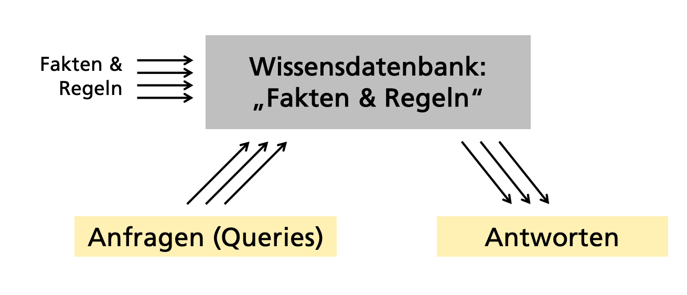
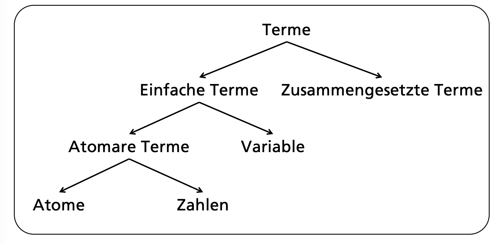
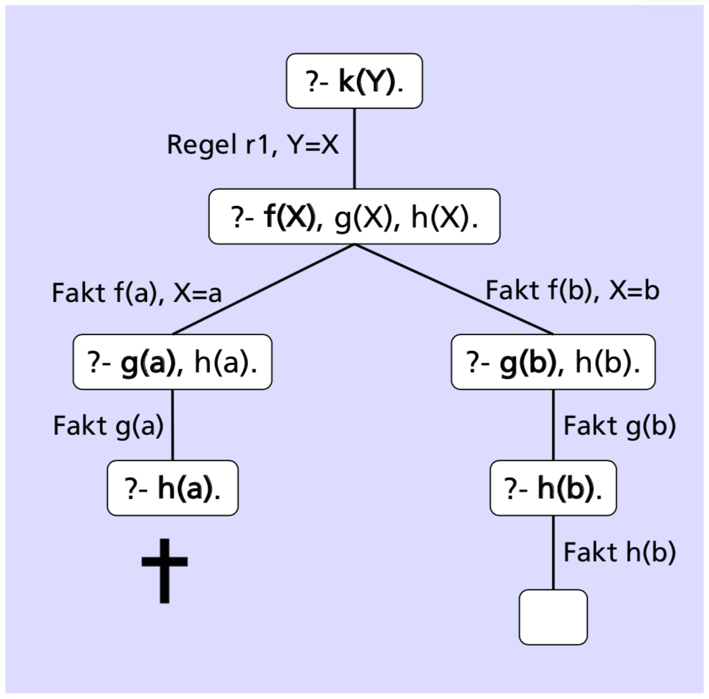
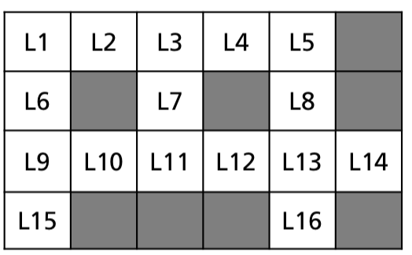
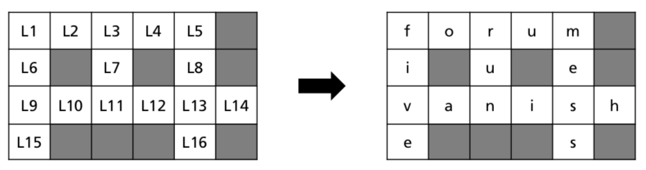
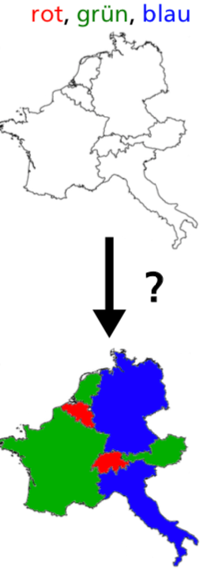

# Prolog

Wir verwenden `swi-prolog`: http://www.swi-prolog.org

Prolog (_PROgrammation en LOGique_) entstand in den frühen 1970er Jahren und basiert auf der Prädikatenlogik erster Stufe. Die Notation von Regeln entspricht Horn-Klauseln.

## Big Picture: Funktionsweise von Prolog

Wissensdatenbank bestehend aus Fakten und Regel. Diese kann abgefragt werden durch Queries.



## Einstiegsbeispiel

Ein erstes Prolog-Programm, bestehend aus den
folgenden drei Beispiel-Fakten in der
Wissensdatenbank\_:

```prolog
bigger(elephant, horse).
bigger(horse, dog).
bigger(horse, sheep).
```

Bemerkung: `bigger` ist nicht vordefiniert vom System.
Die Definitionen haben für Prolog keine Bedeutung, und weiss beispielsweise nicht, dass die Eigenschaft `bigger` transitiv sein sollte. Deshalb beantwortet Prolog folgende Abfrage mit `false`:

    ?- bigger(elephant, dog).
    false.

Deshalb definieren wir eine _transitive Hülle_, d.h. ein Prädikat, mit welchem ein Tier A grösser ist als ein Tier B, wenn wir dazwischen mit den früher definierten Fakten über andere Tiere iterieren können.

```prolog
is_bigger(X, Y) :- bigger(X, Y).
is_bigger(X, Y) :- bigger(X, Z), is_bigger(Z, Y).
```

- `:-` = `if`
- `,`= `and`

Mit dieser neuen Abfrage bekommen wir dieses Resultat:

    ?- is_bigger(elephant, dog).
    true.

Die selbe Abfrage kann mit einer Variable verwendet werden. Die Ausgabe enthält dann alle gültigen Werte für diesen Ausdruck:

```prolog
?- is_bigger(X, dog).
X = horse ;
X = elephant ;
false.
```

Eine weitere Beispiel-Abfrage:

Gibt es ein Tier, das kleiner als ein Elefant und grösser als ein Hund ist?

```prolog
?- is_bigger(elephant, X), is_bigger(X, dog).
X = horse ;
false.
```

## Prolog Syntax



### Terme

Zahlen (`numbers`):

    123, 33.3, -4

Atomare Terme (`atoms`): beginnen mit Kleinbuchstaben oder sind eingeschlossen in einfache Anführungszeichen:

    elephant, a_bc, ‘Hallo mein Text‘, is_bigger

Variablen (`variables`): beginnen mit Grossbuchstaben oder einem Unterstrich (underscore)

    X, Elephant, _, _elephant

Anonyme Variablen (`_`): Platzhalter für einen Wert, der nicht ausgegeben werden soll:

    ?- is_bigger(_, horse).
    true .

Zusammengesetzte Terme: (`compound terms`): besteht aus einem Funktor und Argumenten:

    functor(argument1, argument2)

Aus dem Beispiel oben:

    is_bigger(horse, X)

### Grundterme

Terme ohne Variablen, 'Fakten' in der Wissensdatenbank:

    bigger(me, you)
    write(‘bonjour monde‘)

## Prädikate

Die _Stelligkeit_ eines Prädikats beschreibt die Anzahl Argumente. Prolog behandelt zwei Prädikate mit gleichem Funktor aber mit unterschiedlicher Stelligkeit als zwei verschiedene Prädikate.

n der Prolog-Doku wird die Stelligkeit meist mit Suffix „/“ und danach der entsprechenden Zahl angegeben:

- `consult/1`
- `working_directory/2`
- `is_bigger/2`

### Eingebaute Prädikate

SWI-Prolog enthält zahlreiche eingebaute Prädikate. Diese sind in derOnline Doku beschrieben: http://www.swi-prolog.org/pldoc/man?section=builtin

Beispiele:

1. Eine Programm-Datei kompilieren: `consult/1`

   ?- consult(bigger).
   % bigger.pl compiled 0.00 sec, 12 clauses true.
   ?-

Liest die Datei `bigger` oder `bigger.pl` ein. Gegebenenfalls muss davor mit `working_directory/2` das aktuelle Verzeichnis gesetzt werden.

2. Argumente in die Konsole schreiben: `write/1`

   ?- write('hallo hslu').
   hallo hslu
   true.

3. Standard Input lesen: `read/1``

   ?- read(X), write(X).
   |: 'aha, so geht das!'.
   aha, so geht das!
   X = 'aha, so geht das!'.

## Prolog Queries

Anfragen (Queries) sind Prädikate (oder Sequenzen von Prädikaten) gefolgt von einem Punkt. Diese werden beim Prolog-Prompt (`?-`) in der Konsole eingegeben und veranlassen das System zu antworten:

?- is_bigger(elephant, dog). % query
true .

## Wichtige Begriffe

- _Klauseln_ (clauses) = Fakten und Regeln (sind zusammengesetzte Terme)
- _Prozedur_ (procedure) = Alle Klauseln zum gleichen Prädikat (d.h. alle Relationen mit gleichem Name [d.h gleichem Funktor] & gleicher Stelligkeit)
- Prolog-Programm = eine Liste von Klauseln

Prolog-Programme bestehen aus Fakten und Regeln, die in der aktuellen Wissensdatenbank abgelegt sind.

- _Fakten_ (facts) = Prädikate gefolgt von einem Punkt. Fakten sind typischerweise Grundterme (Prädikate ohne Variablen)
- _Regeln_ (rules) bestehen aus einem Kopf (head) und einem Hauptteil (body), durch :- getrennt. Der Kopf einer Regel ist wahr,falls alle Ziele (Prädikate) im Hauptteil als wahr bewiesen werden können, z.B.:

      grandfather(X, Y) :-        % head
      father(X, Z),               % body, goal 1
      parent(Z, Y).               % body, goal 2

Ziele im Hauptteil werden durch `,` (Komma) abgetrennt und ganz am Schluss durch `.` (Punkt) abgeschlossen.

## Matching

1. Zwei atomare Terme _matchen_ genau dann wenn
   sie die gleiche Zahl oder das gleiche Atom sind.
2. Falls einer der Terme eine Variable ist, dann
   matchen die beiden Terme und die Variable wird
   mit dem Wert des zweiten Terms instanziiert.
3. Zwei zusammengesetzte Terme matchen g.d.w.:
   – gleicher Funktor, gleiche Stelligkeit
   – alle korrespondierenden Argumente matchen

### Beispiel

Zwei Regeln in der Wissensdatenbank:

```swipl
vertical(line(point(X,_), point(X,_))).
horizontal(line(point(_,Y), point(_,Y))).
```

Beispielabfragen:

    ?- vertical(line(point(1,1), point(1,5))).
    true.
    ?- horizontal(line(point(1,2),point(3,X))).
    X = 2.
    ?- horizontal(line(point(1,2),P)).
    P = point(_G1155, 2). % _G1155 means "any number"

## Beweissuche und Suchbäume

Bei einer Anfrage an die Wissensdatenbank schaut das System automatisch, ob diese Anfrage aus den aktuellen Fakten & Regeln herleitbar (d.h. beweisbar) ist. Dabei wird für jeden Term in der Anfrage sequentiell durch die Wissensdatenbank geschaut, mit welchen Klauseln dieser gematched werden kann.

Dadurch entsteht der im nachfolgenden Beispiel skizzierte Suchbaum, in welchem mittels Backtracking Lösungen (d.h. ein Beweis) für die Anfrage gesucht werden. alls alle Anfrage-Terme (rekursiv) aufgelöst werden können, liefert das System `true` (ggf. die dazu notwendigen Matchings) zurück, ansonsten `false`.

Bweissuche anhand eines Beispiels:

Wissensdatenbank

    f(a).
    f(b).
    g(a).
    g(b).
    h(b).
    k(X) :- f(X), g(X), h(X). % r1

Anfrage

    ?- k(Y).

Antwort

    Y=b.
    ?-

Diese Anfrage wird von Prolog folgendermassen abgearbeitet (Suchbaum):



Die _Suchreihenfolge_ (in der Wissensdatenbank) ist von oben nach unten. Die Abarbeitungsreihenfolge (Suchbaum, siehe Bild oben) ist von links nach rechts.

## Beispielprobleme

Typische Prolog-Standardprobleme sind:

- Kreuzworträtsel lösen
- Karten färben
- Zahlenrätsel lösen
- Sudoku lösen
- Spracherkennung: Grammatik definieren, korrekte Sätze erkennen, Inhalt „verstehen“ (Semantische Analyse), ...
- Expertensysteme
- u.v.a.m.

Ein paar davon werden hier kurz aufgezeigt.

## Beispiel: Kreuzworträtsel

**Ausgangslage**:

Gegeben sind 6x4 Felder, `LX` = Buchstabe an Stelle X:



Erlaubte Wörter (d.h. das „Vokabular“):

    dog, run, top, five, four, lost, mess, unit, baker, forum, green, super, prolog, vanish, wonder, yellow

Jede Zelle `LX` soll mit einem Buchstaben gefüllt werden, so dass in allen zusammenhängenden weissen Zeilen und Spalten erlaubte Wörter stehen.

**Vorgehen**:

Alle erlaubten Wörter erfassen, und zwar als Prädikat `word/n`. Zum Beispiel:

    word(d, o, g).

`dog` wird hier als ein gültiges Wort mit drei Buchstaben definiert. Ausserdem müssen wir Regeln für alle Zeichen `LX` definieren. Darin soll beschrieben sein, dass wir 16 Zeichen suchen, und dass sie zusammen ein erlaubtes Wort bilden müssen.

```
% words that may be used in the solution

word(d,o,g).	   word(r,u,n).	      word(t,o,p).
word(f,i,v,e).     word(f,o,u,r).     word(l,o,s,t).      word(m,e,s,s).     word(u,n,i,t).
word(b,a,k,e,r).   word(f,o,r,u,m).   word(g,r,e,e,n).    word(s,u,p,e,r).
word(p,r,o,l,o,g). word(v,a,n,i,s,h). word(w,o,n,d,e,r).  word(y,e,l,l,o,w).

solution(L1,L2,L3,L4,L5,L6,L7,L8,L9,L10,L11,L12,L13,L14,L15,L16) :-
	word(L1,L2,L3,L4,L5),			%  Top horizontal word
	word(L9,L10,L11,L12,L13,L14),		%  Second horizontal word
	word(L1,L6,L9,L15),			%  First vertical word
	word(L3,L7,L11),			%  Second vertical word
	word(L5,L8,L13,L16).			%  Third vertical word
```

**Lösung**:

Damit sind wir fertig, das Problem ist dadurch beschrieben. Aufgerufen wird die Lösung so:

    ?- solution(L1,L2,L3,L4,L5,L6,L7,L8,L9,L10,L11,L12,L13,L14,L15,L16).
    L1 = f,
    L2 = o,
    L3 = r,
    L4 = L7, L7 = u,
    L5 = m,
    L6 = L12, L12 = i,
    L8 = L15, L15 = e,
    L9 = v,
    L10 = a,
    L11 = n,
    L13 = L16, L16 = s,
    L14 = h
    false.



## Beispiel: Karten färben

**Ausgangslage**:

Eine Karte mit verschiedenen Ländern und 3 verschiedenen Farben, so dass jedes Land eine Farbe hat, und benachbarte Länder jeweils unterschiedliche Farben haben.



**Vorgehen**:

Neues Prädikat n/2 (für „Nachbar“):

n(red, green).

Das bedeutet für uns, dass rot und grün nebeneinander sein können. Welche Länder nebeneinander sind, modellieren wir mit dem selben Prädikat:

    n(CH, I).

Die Schweiz ist ein Nachbar von Italien. (Die Länder sind mit Grossbuchstaben geschrieben und somit Variablen. Diesen soll dann eine Farbe zugewiesen werden.)

Alle definierten `n(X,Y)` Regeln müssen natürlich gleichzeitig erfüllt sein. Deshalb fügen wir ein weiteres Prädikat `colors/7` ein, dass die Nachbarschaften von den Ländern regelt.

Um die Anzahl Lösungen klein zu halten, fügen wir eine zusätzliche Einschränkung ein:

    CH = red

Das ganze Programm sieht dann so aus:

```
% possible pairs of color of neighboring countries
n(red, green).		n(red, blue).
n(green, red).		n(green, blue).
n(blue, red).		n(blue, green).

% countries and neighbors
colors(CH, A, D, I, F, B, N) :-
	CH = red,
	n(CH, A), n(CH, I), n(CH, F), n(CH, D),
	n(A, D), n(A, I),
	n(I, F),
	n(F, B),
	n(D, B), n(D, N),
	n(B, N).

% colors(CH, A, D, I, F, B, N).
```

**Lösung**:

```
?- colors(CH, A, D, I, F, B, N).
CH = B, B = red,
A = F, F = N, N = green,
D = I, I = blue
```

Der fehlende Punkt am Ende zeigt uns an, dass es noch weitere Lösungen gibt. Diese können mit `;` angezeigt werden. Danach sieht die Ausgabe so aus:

```
?- colors(CH, A, D, I, F, B, N).
CH = B, B = red,
A = F, F = N, N = green,
D = I, I = blue
CH = B, B = red,
A = F, F = N, N = blue,
D = I, I = green
false.
```

## Operatoren

Wenn man Prolog fragt, was `X = 1 + 2` ist, bekommt man folgende Antwort:

    ?- X = 1 + 2.
    X = 1+2.

Der Operator `=/2` macht nur ein Matching, Ausdrücke werde nicht automatisch ausgewertet. Dafür kann der `is/2` Operator genutzt werden.

    ?- X is 1 + 2.
    X = 3.

Es gibt zahlreiche eingebaute arithmetische Operatoren:

- `+`: Addition
- `-`: Subtraktion
- `*`: Multiplikation
- `/`: Division
- `**`: Potenz
- `//`: Ganzzahldivision
- `mod`: Modulo

Weitere: http://www.swi-prolog.org/pldoc/man?section=functions

Einige Beispiele:

    ?- D is 5/2.
    D = 2.5.

    ?- I is 5//2.
    I = 2.

    ?- C is cos(0).
    C = 1.0.

    ?- S is sqrt(9).
    S = 3.0.

Vordefinierte arithmetische Vergleichsoperatoren:

- `>`: grösser als
- `<`: kleiner als
- `>=`: grösser gleich
- `=<`: kleiner gleich
- `=:=`: Gleichheit
- `=\=`: Ungleichheit

_Hinweis: Diese Operatoren erzwingen die arithmetische Auswertung ihrer beiden Operanden._

SWI-Doku: http://www.swi-prolog.org/pldoc/man?section=arithpreds

Beispiele:

    ?- 88 =< 77.
    false.

    ?- 44 =\= 42 + 1.
    true.

    ?- 1 + 2 = 2 + 1.   % '=' is for matching!
    false.              % '1+2' does not match '2+1'

    ?- 1 + 2 =:= 2 + 1.
    true.

### Operatoren und Prädikate

Grundsätzlich gibt es in Prolog nur Prädikate. Operatoren sind lediglich Prädikate mit einer anderen Schreibweise.

Beispiel `=/2`:

    ?- =(tom, tom).     % Prädikatenschreibweise
    true.

    ?- tom = tom.       % Operatorenschreibweise
    true .

Mit dem eingebauten Prädikat `op/3` können Prädikate als Operatoren deklariert werden:

    ?- op(1150, xfx, is_bigger).    % declare new operation
    true.

    ?- elephant is_bigger dog.      % use our new operation
    true.

Ein paar Beispiele bereits vordefinierter Operatoren:

| Präzedenz | Typ | Name                                              |
| --------: | --- | ------------------------------------------------- |
|      1200 | xfx | `-->`, `:-`                                       |
|      1200 | fx  | `:-`, `?-`                                        |
|      1100 | xfy | `;`, `|`                                          |
|      1000 | xfy | `,`                                               |
|       900 | fy  | `\+`                                              |
|       700 | xfx | `<`, `=`, `=:=`, `=\=`, `is`, ...                 |
|       500 | yfx | `+`, `-`, `/\`, `\/`, `xor`                       |
|       400 | yfx | `*` , `/`, `//`, `rdiv`, `<<`, `>>`, `mod`, `rem` |
|       200 | xfx | `**`                                              |
|       200 | fy  | `+`, `-`, `\`                                     |

Ganze Tabelle: http://www.swi-prolog.org/pldoc/man?predicate=op/3

Die **Präzedenz** (oder Operatorrangfolge) von einem Operator gibt an, wie stark dieser Operator seine Operanden bindet. Je tiefer die Präzedenz, desto stärker ist die Bindung.

Der **Typ** gibt die relative Reihenfolge von Operator `f` und den Operanden `x`, `y` an. Es gibt drei Gruppen:

- Infix: `xfx`, `xfy`, `yfx`
- Präfix: `fx`, `fy`
- Postfix: `xf`, `yf`

Mit `x` und `y` wird die Präzedenz der Operatoren einer Operation festgelegt:

- `x` repräsentiert einen Operanden, dessen Präzedenz strikt kleiner ist als die Präzedenz vom Operator `f`.

- `y` repräsentiert einen Operanden, dessen Präzedenz kleiner oder gleich derjenigen vom Operator `f` ist.

Damit wird festgelegt, wie Ausdrücke mit mehreren gleichen Operatoren ausgewertet werden, z.B. bei `a - b - c` oder `1000 / 100 / 10`.

Wenn man mehrere Operatoren vom Typ `xfx` nacheinander schreibt, ist also nicht klar geregelt, in welcher Reihenfolge der Ausdruck ausgewertet werden soll, und es gibt eine Fehlermeldung:

    ?- X is Y is 42.
    ERROR: Syntax error: Operator priority clash
    ERROR: X i
    ERROR: ** here **
    ERROR: s Y is 42 .

## Rekursion

Prädikate in Prolog können rekursiv definiert sein, d.h. eine oder mehrere Regeln beziehen sich in ihrer Definition auf sich selber. Dies wird in Prolog sehr häufig verwendet.

Im Prinzip wird Rekursion immer gleich eingesetzt, ein Problem wird in Fälle aufgeteilt, welche zu einer der folgenden beiden Gruppen gehören:

1. Einfache Fälle oder Grenzfälle, „direkt“ lösbar
2. Allgemeine Fälle, zu denen die Lösung mithilfe von Lösungen von (einfacheren) Versionen vom gleichen Problem konstruiert werden kann

Beispiel `is_bigger`:

    is_bigger(X, Y) :- bigger(X, Y).                    % simple case
    is_bigger(X, Y) :- bigger(X, Z), is_bigger(Z, Y).   % general case

**Beispiel Fakultät**:

    fak(0, 1).          % simple case
    fak(N, F) :-        % general case
        N > 0,          %   argument test
        N1 is N–1,      %   evaluateN-1
        fak(N1, F1),    %   recursive call
        F is N * F1.    %   sum up

Query:

    ?- fak(5, X).
    X = 120
    false.

**Beispiel Fibonacci**:

    fib(0, 0).
    fib(1, 1).
    fib(N, F) :-
        N > 1,
        N1 is N – 1,
        N2 is N - 2,
        fib(N1, F1),
        fib(N2, F2),
        F is F1 + F2.

Query (7. Fibonacci-Zahl):

    ?- fib(7, X).
    X = 13 .
